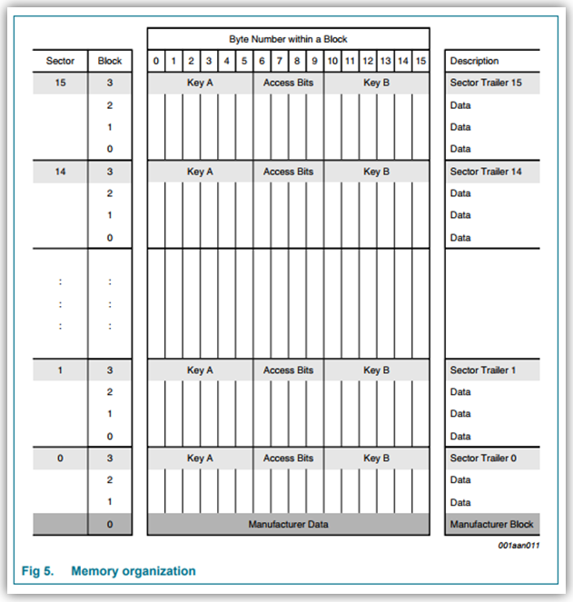
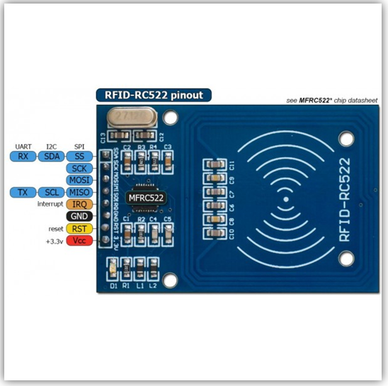
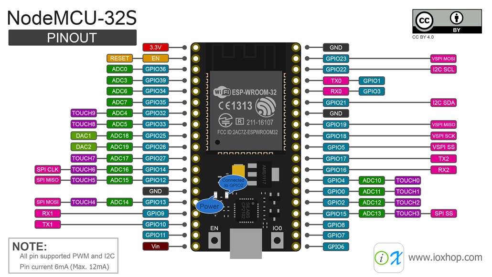

# Autenticão-RFID-e-ESP32NodeMCU

## Em fase de Desenvolvimento

## Resumo
Algoritimo desenvolvido para a gravação e obtenção de dados apartir de TEGs do tipo RFID 13,56Mhz obetivando tando a obtenção quanto a publicação destes dados em brokers sejam publicos ou privados visando seu uso como  Autenticação e altorização (AA): Multi-Fator usando (IoT) *internet of things*.
## Descrição 
Foi utilizado como ferramente par auxiliar no desenvolvimento o [Arduino IDE 1.8.19](https://www.arduino.cc/en/software) para a escrita do codigo, tambem como o broker publico [HiveMQ](broker.hivemq.com) permitido o uso apartir do protocolo [MQTT](https://mqtt.org/).

 ### Dispositivos utilizados
  1 - Modulo Leitor RFID-Mfrc522
    1 - Catão(TAG) RFID 13,56Mhz
    1 - ESP32S NodeMcu ESP-12

### Bibliotecas Utilizadas
- [WiFi.h](https://github.com/arduino-libraries/WiFi) 
- [PubSubClient.h](https://github.com/knolleary/pubsubclient) 
- [MFRC522.h](https://github.com/miguelbalboa/rfid) 
- [SPI.h](https://www.arduino.cc/reference/en/language/functions/communication/spi/)

### Pinagem

Imagem 1: Estrutura de memoria de uma TEG RFID 

1 Imagem 1.2: PinOUT RFID 

1 Imagem 1.3: PinOUT Esp32s-NodeMCU 
